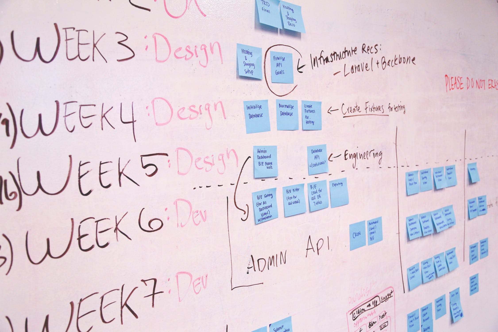

## Design Patterns? Like Plaid?

Regardless of expertise, patterns are used throughout the fashion industry. Where items of clothing can vary in texture, print, and accents, a lot of structural aspects of the pieces remain the same. In software engineering, design patterns provide similar foundations to code. Where the basic architecture of a shirt hardly varies between designers, choices in fabric, seams, cuts, and sleeves, can make all the difference. Similarly, where software engineers might approach their applications with the same model-view-controller design pattern, the actual applications could be completely different.

Through the use of patterns, knowledge can be shared and adapted for greater efficiency and effectiveness. In fashion, this means allowing amateurs to build upon pre-existing styles to create their own unique items. Designers can, then, worry less on the basic function ("Did I leave enough seam allowance?") and focus more on the artistic signature to what they create. Design patterns offer programming and software engineering similar foundations for structure and approach. With pre-existing general solutions to common problems, developments can occur quicker--as the use of resources leaves new applications and programs with already constructed foundations. This initial boost in progress leaves a lot more time and energy into the creation of different and useful software for the world.

## Not Starting from Scratch

When I first took a fashion design class, patterns were the go-to. Patterns that came in little paper pouches were the saving grace of straight cuts and properly sized seam-allowances. By following patterns and utilizing them as-is, I learned basic approaches and technique to sewing and design. This is similar to the approach to design patterns that ICS 314 begins with.

In similar fashion, towards mid-semester of ICS 314, a lot of work was done as small manipulations to the [meteor-application-template-react](https://ics-software-engineering.github.io/meteor-application-template-react/) template. These Workout-Of-the-Days (WODs) taught me (though I was not aware at the time) basic understandings of design patterns, like the Publisher-Subscriber design pattern, which influenced my design in my final project.

As fashion design classes started with using patterns because, as far as I knew, that was the easiest thing to do--I grew to understand their use. In a fashion design competition, I was able to adjust patterns and my knowledge of their architecture to construct my own pattern and dress. What time I saved in using patterns for the basic foundations of the structural design of my dress, I was able to apply to accent, color, and more aesthetic considerations.

Likewise, by utilizing the [meteor-application-template-react](https://ics-software-engineering.github.io/meteor-application-template-react/) template in our final project, my group was able to put more focus into the unique drag-and-drop aspects of our [Classtellations](https://uh-classtellations.github.io/) project. The provided set-up for a Publisher-Subscriber design pattern allowed us to efficiently support unique transcripts for various users and control data being imported, shared, and displayed. Without the use of said design pattern, we would have dedicated hours--or even days--to developing a structure and code that could function as we wanted it to.

You cannot design an outfit without knowing the basic approaches to a shirt or skirt. There's really no software engineering without considering the design patterns there for use.