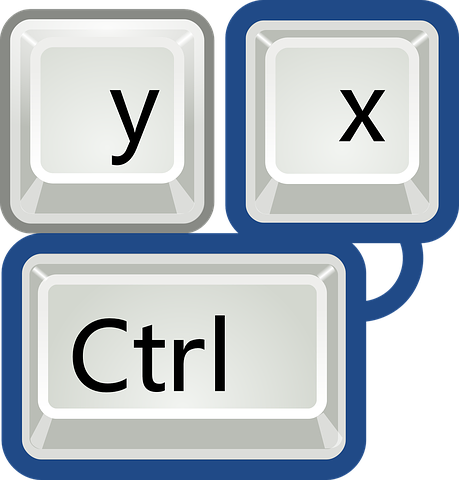

One of the biggest concerns of Economics is opportunity costs. The field weighs costs against gains and maintains that decisions should be based upon what provides the most returns. In software engineering, the process of learning and implementing User Interface (UI) Frameworks is a prime example of where weighing costs and benefits comes into play.

## Back to Basics

When it comes to learning computer shortcuts, there is a time period of trying to remember commands--usually accompanied by referring to menus with their listed shortcuts or cheat sheets, then practicing using the shortcut over selecting the option from the menu. In the short term, this learning process makes learning more efficient approaches to executing tasks seem very inefficient. Yet, once the learning becomes memorization and "CTRL" becomes your first instinct to cut to your clipboard--over right-clicking or going to the top menu? Life becomes a breeze and instills the notion of why we create shortcuts.

Similarly, UI Frameworks act as shortcuts. They provide elements and modules with pre-existing meanings, appearances, and behaviors. Their existence then allows for eased implementation of consistent and beautiful formats and designs in software engineering. Where it can take a lot of space and time to insure your website looks consistent and cohesive using raw HTML and CSS, UI Frameworks take familiar terms and parts, like images and labels, and has preset ways of making these appear. Instead of working from scratch, UI Frameworks provide basic foundations for approaching use and design.

This is not to say there is no learning curve. UI Frameworks, like Semantic UI, have their own approaches to syntax and diction--which to utilize effectively, there is quite a bit to learn.

## Learning the Semantics

Semantic UI can do a lot to help ease the design and formatting process of web design, which also means there is a lot to learn to implement it effectively. From learning the meanings of each element, state, type, and variation, to adding the code correctly to your HTML files, Semantic UI is far from easy for beginners.

For the Workout-Of-The-Days (WODs) of this module for ICS 314, I struggled with getting the information I defined in classes to properly affect change in the elements of my website. What I thought could take an hour or two, turned into six hours of fiddling with placement and wording. On the other hand, I was able to complete the in-class WOD in less than 20 minutes. Granted, the in-class WOD was much less complex and had added guidance with provided hints--I became aware of how much practice and exposure effective use of UI Frameworks take.

Like learning any shortcut, it takes time to get to a level of familiarity where things become efficient. In the end, however, the short-term cost of extra time spent switching between lists of terms to correctly format your menu and your code, pay off in the long term with your future use of the UI Framework. And while I lack experience with UIs outside of Semantic UI, I can imagine that there are some similarities not unlike the similarities that exist between programming languages. Thus, the opportunity cost of learning a UI Framework may seem futile at start but offers great returns in aesthetic and efficiency.
