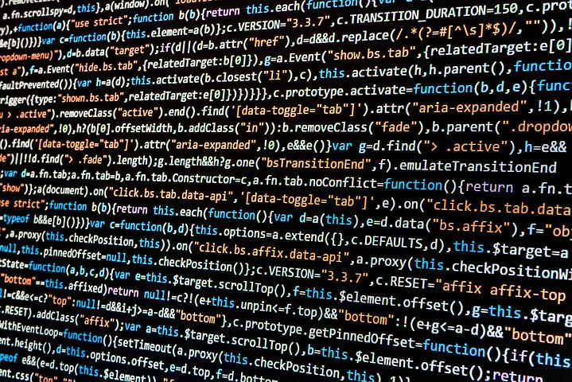

One of the most terrifying parts of a new Computer Science course is the challenge of learning a new language.

It happens to be one of the most exciting parts of Computer Science, too.

## JavaScript? Is That Just Java's Full Name?



Going into ICS 314: Software Engineering I, at the University of Hawaii at Manoa (UHM), all I knew was that JavaScript was a programming language that existed--and that maybe, "Java," was just short for, "JavaScript." After going through freeCodeCamp's challenges of, "Basic JavaScript," and "ES6," I have learned that the latter is not quite the case. While I have come to find similarities between the two, making the initial introduction to JavaScript a smoother transition, Java and JavaScript have differences as well.

A notable difference between Java and JavaScript, along with C++ and JavaScript, is the lack of variable-type declaration within the code.

### Java:
```
  int j = 0;
  String messageJava = "Hello";
```

### C++:
```
  int c = 0;
  string messageCPP = "Hello";
```

### JavaScript:
```
  let js = 0;
  let messageJS = "Hello";
```

At first impression, this amazed me. With Java driving home, "No, sorry, can't do that! If you said the function returns an 'int' then you CAN'T return a 'string'," the chance to forgo declarations and specifications seemed exciting. Alas, it also makes code a bit more confusing. Especially when looking over or continuing code I step away from, it can take a moment or two for me to recall the purposes of certain variables or my plan for how the program was intended to execute. I can imagine that this would become even more confusing in collaboration.

JavaScript seems intriguing as a language for software engineering. From the perspective of Web development, I think the nature of a JavaScript program to be one long "file," so to speak, as compared to the separation of classes in Java, offers a more concise and linear approach to design. I feel that scrolling through a JavaScript program might better mimic the flow of a website, unlike skipping between tabs, which I would find considerably useful in visualizing what my code would be doing. Of course, with little to no Web development experience and extremely basic practice with JavaScript, I would say it is far from my place to debate JavaScript’s value to the software engineering world.

Hopefully, by the end of this semester, I can give a succinct answer towards the relationship of JavaScript and software engineering. With the way ICS 314 seems to be taught, it seems likely.

## Every Educator/Coach Ever: "Practice!"

When I took the introductory courses at UHM for Japanese and American Sign Language (ASL), the professors emphasized the necessity of practice--especially outside of class. This makes sense. I learned English through hearing my family speak the language at home. I developed my reading comprehension and vocabulary through reading in and out of the classroom. On the other end, a lack of practice makes for forgetting. Spending the summer not using ASL made for the start of this semester incredibly difficult.

Like learning a new sport takes practice, understanding and being able to utilize a new language takes practice. A fact that ICS 314 and the professor, Phillip Johnson, truly emphasizes.


The practice Work-Out-of-the-Days (WODs) make for consistent practice of JavaScript, so far, in and out of the classroom. The homework provides self-driven practice and the foundation for honing our skills on the five-of-seven days we do not have class in the week. The in-class practice WODs offer collaboration and outside insight, without the immediate exposure to, "Here is a solution!" Additionally, the forming solutions on our own, then viewing the professor's take on it, offers a new perspective and method of solving the "problem" at hand. (Usually a faster and shorter solution, too.)

This format, with regular practice in class and for homework, ensures we take the time to become familiar with the language we are working with. While some WODs are more difficult than others and require more time, the practice with the language makes for designing the solution the challenge, as opposed to attempting to recall how exactly we declare a variable or write a function. It is time-consuming and makes ICS 314 the course I dedicate the most time to, but like athletes dedicate hours to practice and workouts, developing skills in JavaScript and software engineering would logically take time, too.


