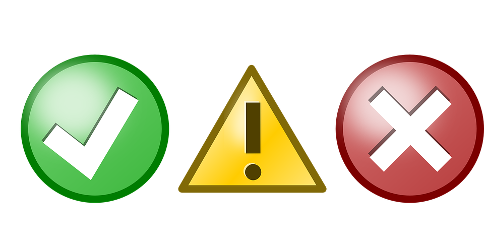

## Who Needs Formatting?


When it comes to writing--whether it be poetry, essays, reports, or novels--there tend to be rules involved. Different forms have different standards, restrictions, and formats, and to no surprise, coding has standards of its own. While, like with all writing, these standards are not the end-all-be-all of the success of a code, I believe they offer consistency that makes collaboration and interpretation much easier.

One of the difficulties, I find, with reading and understanding code, is following the value of variables and their use. While in ICS 314, we have begun to stray from nested loops, coding standards definitely make loops, classes and their functions, and the body of functions, much easier to follow. As long as you have the correct number of curly braces, your code will work, however, without indentations, code can be much more difficult to interpret.

Code without indentation (Does not follow coding standards):

```
	class Menu {

	constructor() {
  	this.items = [];
  	}
  
  	addMenuItem(item) {
  	items.push(item);
  	}
	...}
```

Code with indentation (Follows coding standards):

```
	class Menu {

		constructor() {
  			this.items = [];
  		}
  
  		addMenuItem(item) {
  			items.push(item);
  		}
	...}
```

In the case of indentations, coding standards provide means of easily locating certain classes and functions, as well as discerning between their bodies. Similar to how drawing a circle pulls your focus to the contents of the circle, the declaration of classes, functions, and loops surrounding what is being done within them, eases a reader's ability to focus on the single part of the code, and to interpret the purpose of it.

## But It's *So* Much Work

From an opposing perspective, following coding standards can be quite tedious. Coding standards focus on indentations, the proper placement and use off parenthases, brackets, and braces, the number of spaces between words, and whether or not certain characters need to be on a separate line. Without active attention to these little details, maintaining code that follows proper standards is a timely task.



Luckily, programs exist to help you find any errors that may exist in your code. In the same way Microsoft Word will leave squiggly lines under words with incorrect spelling or places with incorrect grammar, there are programs out there that inspect code and leave warnings for places where coding standards are not followed. In particular, I have started to use ESLint with IntelliJ (an IDE) for ICS 314.

ESLint marks pieces of code that does not follow the coding style standards it has been provided with squiggly lines. Helpfully, the use of it with IntelliJ causes a small lightbulb to appear with information on what the error is and, usually, means of correcting it. In fact, there is an option to let ESLint run and fix what issues in the code that it can solve quite easily on its own. Compared to needing to count spaces and indentations and carefully inspect code character by character, these programs offer efficient means of proofreading and revising code.

So while coding standards definitely make writing code a longer process than it would be without, they do provide great foundations for work that can be easily shared and interpretted by yourself and others. Not to mention, people have created means of expediting inspection and correction, making the real question: Why *wouldn't* you want to utilize and follow coding standards? 
