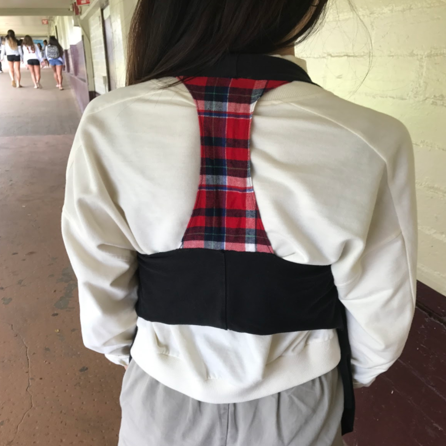
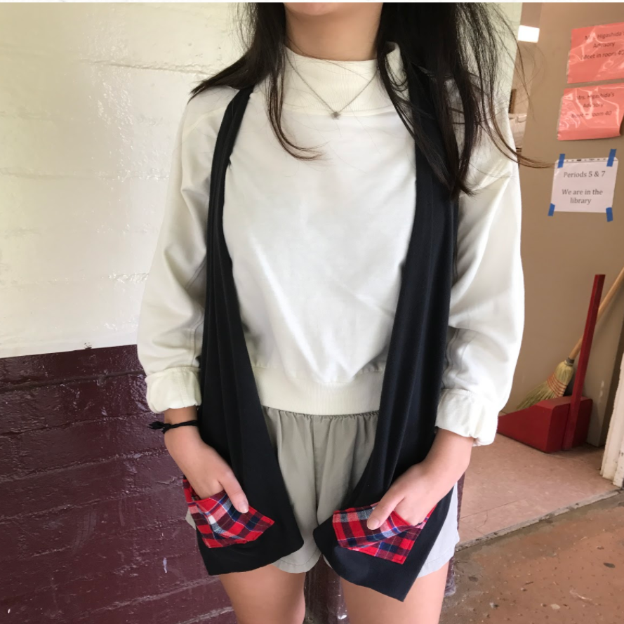

During my Junior year at Castle High School, through the class Fashion Design I, I first competed in the Windward District Performance-Based Assessment in the catergory of Fashion Design and placed first.

The challenge of 2017 was to upcycle at least two pieces of clothing into a garmet targetted towards a specific group. For my project, I took a plain black t-shirt and a red-plaid flannel to create a vest targetted towards teenage fashion. With ample amount of brainstorming and planning, followed by creating my own patterns for the vest, I was able to create a garment I was proud of. After presentations at the school level, I was able to present at the district level and placed first for the Fashion Design challenge.

Where the project was creatively rewarding, the part that stood out to me was the design project and the realization of how my process of creating my submitted garment was similar to the Engineering Design Process. I started out with a problem and took the time to address questions reagarding, "What fashion do teenagers like?" and, "What pieces can I upcycle together? Where the fabric textures and patterns will not clash?" Following this, I brainstormed possible ideas ranging from crop tops to cardigans and eventually landing on the idea of a flowing vest. With a clear picture in mind, I took the stand-out aspects of the various designs I had brainstormed to devleop a singular plan for creating my garment. This was followed by creating the actual vest--though, first testing the pattern on other t-shirts before committing to the final fabric. This then led to the submission of my project.

While the course of the competition ended there, I knew the things I could improve on and took the judges comments to heart. Where there was value in creating a winning piece, I found greater impact in learning to work through a problem and think through the ideas I had in mind. The challenge not only helped me improve in the technical aspect of fashion design and sewing, but the skills of problem solving and the creative process that extend past Fashion Design.

Information regarding the Windward District CTE program and Perfomance-Based Assessments can be found [here](https://sites.google.com/kk.k12.hi.us/windwardcte/performance-based-assessment).

The presentation for my project can be found [here](https://docs.google.com/presentation/d/1DJNkJAPEHCYYKeTKmTs9ahvxnlEyHaJXfnzaDNJnEdQ/edit?usp=sharing).
