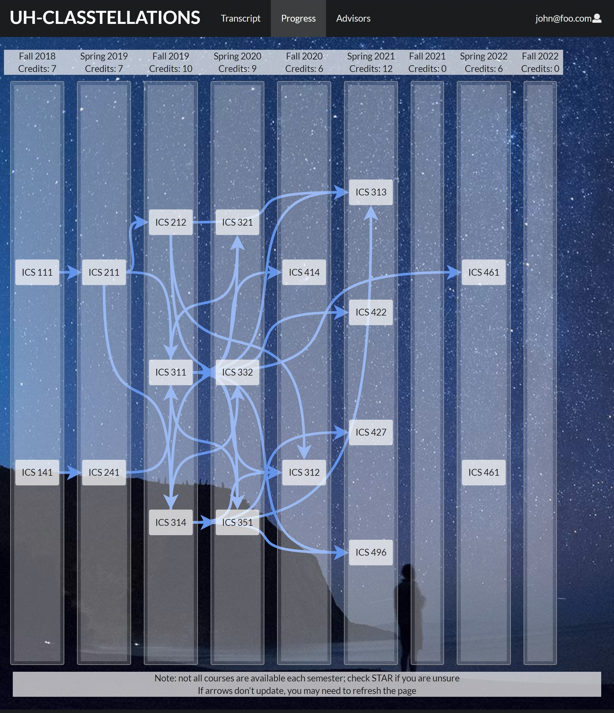

Classtellations is an application intended to help students keep track of their academic progress and future. Currently targeted towards students within the ICS program at UH, the application is intended to be an extension of the STAR GPS program (used by all students within the UH system).

A play on the words "class" and "constellations", the visual appearance of the progress page--similar to a flow-chart--is meant to create a visual map connecting the various ICS courses. Arrows extend from lower division and introductory courses and point to those in which they are pre-requisites for. This allows for students to clearly see and plan their time in the program.

Utilizing various frameworks including Meteor, React, and Semantic UI, the application is a cumulative project that reflects the skills and concepts taught in ICS 314: Software Engineering I. Tasked with implementing the transcript page of the Classtellations project, I was responsible for a large part of the database/server side of the application. This included designing collections and schema, insuring courses added to and deleted from said collections correctly, and listing of courses on the transcript webpage in chronological order.

Collaborating on the project also provided opportunities for practicing team work, communication, time management, and issue-based planning (through GitHub). Classtellations has been the biggest project I have worked on with a team--through an ICS course and at UH. Adding on the lack of physical meetings and discussion due to the COVID-19 pandemic, it became more essential to better my communication skills. While difficult, our team was able to overcome the various obstacles and errors we encountered in building the application through using Discord chat and voice channels.

For more information regarding the Classtellations project and its development, please visit [our project's home page](https://uh-classtellations.github.io/).

The application itself is deployed via Digital Ocean and can be found [here](https://classtellations.xyz/#/).

Source code for the Classtellations project is available [through Github](https://github.com/uh-classtellations/uh-classtellations), however the directory is private and requires a request to access.

