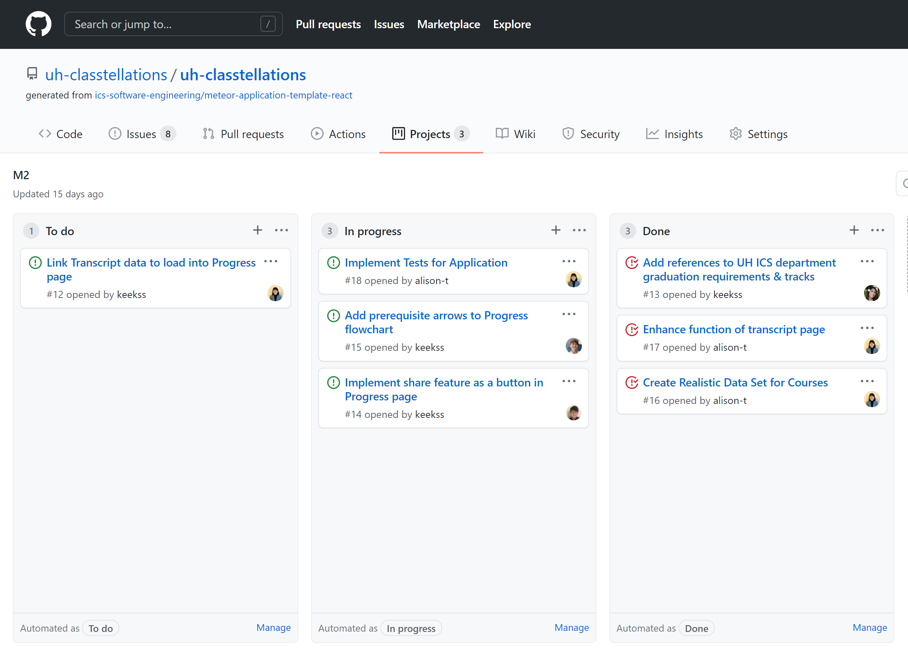

Classtellations is an application intended to help students keep track of their academic progress and future. Currently targeted towards students within the ICS program at UH, the application is intended to be an extension of the STAR GPS program used by all students within the UH system.

A play on the words "class" and "constellations", the visual appearance--similar to a flow-chart--of the progress page, is meant to create a visual map connecting the various ICS course. Arrows extend from lower division and introductory course and point to the courses in which they are pre-requisites for.

Utilizing various frameworks including Meteor, React, and Semantic UI, the application in a cumulative project that reflects the skills and concepts taught in ICS 314: Software Engineering I. Collaborating on the project also provided opportunities for practicing team work, communication, time management, and issue-based planning (through GitHub).

For more information regarding Classtellations, please visit [our project's home page](https://uh-classtellations.github.io/).

The application itself is deployed via Digital Ocean and can be found [here](https://classtellations.xyz/#/).

