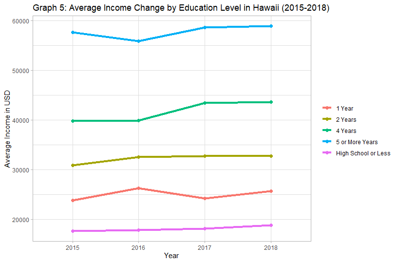

Two fields I have found intriguing for future careers have been in Economics and Computer Science. With having switched majors from Computer Science to Econmics, while still planning to minor in the former, ECON 256: Data Analysis and Visualization seamlessly brought my two interests together.

Throughout the Spring 2020 semester, ECON 256 was a course that taught methods of organizing and analyzing data using the programming language of R, and how to create interesting and interactive graphics with the language. The class culminated with a final project on a research question of our choosing, with the requirements of at least five graphics created in R through RStudio.

It had always been a question of mine, whether college would actually be worth its financial burden. With tuitions, alone, ranging from $10,000 to $40,000 across the country, I was interested to know if higher degrees truly offered such a difference in future income. Alas, data from various surveys seemed to think so.

Outside of having answered the question, the project showcases a semster's development in a programming language unlike ones I experienced in Computer Science courses. It took time to learn, but it was great to bring my interests in Economics and Computer Science together to address a topic of personal concern. The research project showed me the ways Economics and Computer Science can reach areas outside of their own--that Econmics offered me the skills to view and analyze costs, while Computer Science provided skills that did not need to be retricted to designing a website or game.

All in all, my final project for ECON 256 was a moment of realizing that possibilites to explore fields that combined several of my interests were out there and much less limited than I thought.

You can find my research project's code and report, [here](https://github.com/alison-t/econ-256-final-project).

