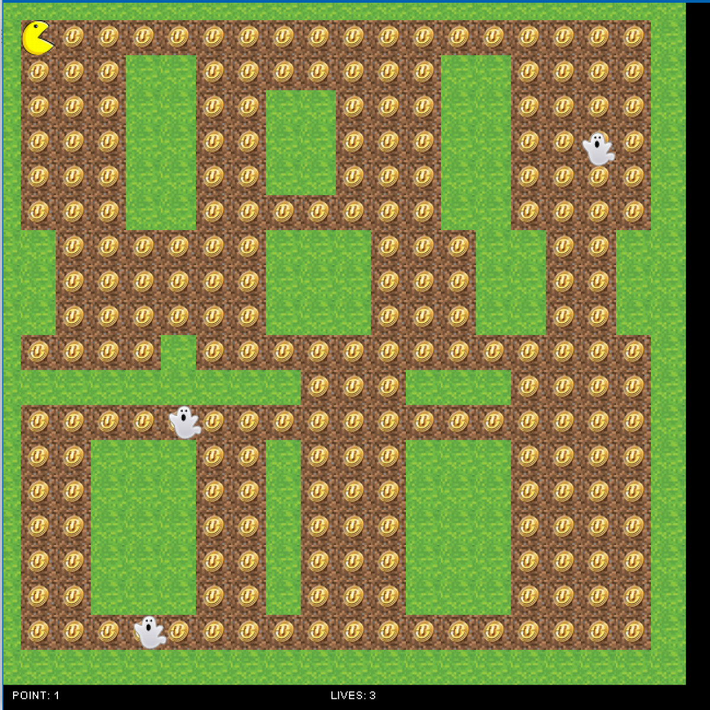

  

ICS 111 is the introductory course for the Computer Science program at UH Manoa. Over the semester, we are taught how to use the language, Java. As a final showcase of what we learned in the class, we were assigned to create a project utilizing various concepts covered throughout the semester.

These concepts included:
  - Array Lists
  - File Reading/Parsing
  - File Writing
  - 2D Arrays
  - Inheritance
  - Private and Public Member Variables and Functions
  

  
Working with two of my classmates, we designed a game that mimicked Pacman--minus the use of wraparound gameplay. File reading and 2D arrays were utilized to create the map for the game. Private and public variables and functions were used throughout the classes of the code, as necessary. I contributed the "ghost", "life", and "point" classes. Additionally, the "main" class involved significant contribution from all members.

In creating the project, I developed a greater understanding of what code can create and the pros and cons of collaboration.

With classroom settings being limited and lack of experience proving to be an obstacle in what I could create at the time, the final product of a functioning game was incredibly fulfilling and eye-opening. The project became physical proof that learning to code and developing proficiency in programming language take time and practice. I did not need some innate aptitude towards either.

Less specific to Computer Science, though possibly more important, I gained a better understanding of teamwork and collaboration. On one end, I realized the necessity of communication and follow-through. As a freshman in college without a license, my means of transportation and free time were quite limited--as were that of my group members. With limited time to complete the project, we managed to find one sufficient day to meet to work on the project outside of class. A meeting that was significantly less productive with members not having made progress on their classes and failing to show up on time.

Despite those challenges, collaboration offered efficiency and chances to learn from each other. Throughout ICS 111, I struggled a lot with file reading and writing. On the other hand, one of my teammates was quite excellent at it, thus being delegated the task of writing the "map" class. Not only did this help our team to develop the project quicker, but I also had the opportunity to learn from my teammate in their writing of the code. Similarly, I assisted my other teammate with writing the portion of the code responsible for the player's movement with the W, A, S, and D keys. It became apparent that there were pros and cons to teamwork, but the struggles of collaboration could be worked towards improving.

Our project's code can be found [here](https://github.com/GilgameshKingOfHeroes/Pac-man).

